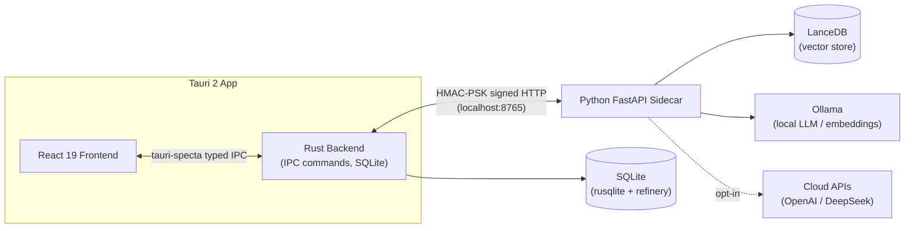

# FileMind

**Desktop file organizer with RAG Q&A** — powered by Tauri 2 + React 19 + Python FastAPI Sidecar.

FileMind is a local-first desktop app that helps you organize files with rule-based/heuristic classification, and ask natural-language questions over your documents via Retrieval-Augmented Generation (RAG). All AI processing runs locally by default (Ollama); cloud inference is opt-in behind an explicit consent flow.

---

## Features

- **Guided onboarding** — 3-step first-run wizard (inference mode → cloud consent → scan directory)
- **File management** — directory scanning, virtualized list, category/status filters, sort, and a slide-out preview drawer (text / image / PDF)
- **Smart classification** — rule engine + heuristic fallback → preview plan → execute with progress overlay → 24-hour undo
- **RAG Q&A** — streaming answers via SSE, citation chips that jump to source files, multi-turn context
- **Rule editor** — create/edit/delete/enable rules, drag-to-reorder priority
- **Settings** — inference mode switching, Ollama environment probe, embedding model management, light/dark/system theme
- **System tray & single instance** — close-to-tray, ⌘⇧F to show window (planned), ⌘1–⌘4 / ⌘, navigation shortcuts
- **Global error boundary** — uncaught render errors show a recovery UI instead of a blank window

---

## Architecture



- **Frontend** (`src/`): React 19 + TypeScript + Zustand + React Router + Vite
- **Backend** (`src-tauri/`): Rust + Tauri 2, all data access via native SQL (rusqlite), schema managed by refinery migrations
- **AI sidecar** (`python-sidecar/`): FastAPI service for RAG, classification, embeddings, and inference probing. The Rust layer is the **only** client — the frontend never talks to the sidecar directly.

---

## Tech Stack

| Layer         | Technology                                                    |
| ------------- | ------------------------------------------------------------- |
| Desktop shell | Tauri 2, Rust (≥ 1.97)                                        |
| Frontend      | React 19, TypeScript, Zustand, React Router 7, Vite 8         |
| Database      | SQLite (rusqlite), FTS5 full-text search, refinery migrations |
| AI service    | Python FastAPI, LanceDB, Ollama, httpx                        |
| Type sync     | tauri-specta (Rust → TypeScript, auto-generated)              |
| Testing       | Vitest, cargo test, pytest                                    |

---

## Prerequisites

- **Node.js ≥ 24** and npm
- **Rust ≥ 1.97** (via [rustup](https://rustup.rs))
- **Python ≥ 3.x**
- **Ollama** (optional, required for local inference) — [install](https://ollama.com/download)
- **Tauri CLI** (`cargo install tauri-cli@^2 --locked`)

---

## Getting Started

```bash
# 1. Initialize the dev environment (installs deps, venv, Tauri CLI)
bash scripts/bootstrap.sh

# 2. Start the full app (frontend + Tauri + sidecar)
make dev
```

The app launches hidden and shows once the frontend is ready. On first run you'll go through the onboarding wizard.

---

## Development Commands

| Command            | Description                                                |
| ------------------ | ---------------------------------------------------------- |
| `make dev`         | Full app (`npm run dev:tauri`)                             |
| `make dev:web`     | Frontend only (Vite)                                       |
| `make dev:sidecar` | Python sidecar only (uvicorn :8765)                        |
| `make test`        | Frontend + Rust + Python tests                             |
| `make build`       | Production bundle (`tauri build`)                          |
| `make lint`        | ESLint + Clippy + Ruff + mypy                              |
| `make format`      | Prettier + rustfmt + ruff format                           |
| `make gen:ipc`     | Regenerate TypeScript types from Rust (`src/types/ipc.ts`) |
| `make install`     | Install all dependencies                                   |
| `make testdata`    | Seed demo data (init DB + generate files)                  |
| `make clean`       | Clean build artifacts                                      |

---

## Project Structure

```
filemind/
├── src/                    # React 19 + TypeScript frontend
│   ├── components/         #   layout / file / classify / chat / rules / settings / common
│   ├── pages/              #   FilesPage / ClassifyPage / ChatPage / RulesPage / SettingsPage
│   ├── stores/             #   Zustand stores (file / classify / chat / rule / settings)
│   ├── lib/                #   IPC clients, table logic, theme, formatting
│   ├── hooks/              #   useHotkeys
│   ├── types/              #   ipc.ts (generated) + models.ts
│   └── styles/             #   globals.css (CSS variables, light/dark themes)
├── src-tauri/              # Rust + Tauri 2 backend
│   └── src/
│       ├── commands/       #   IPC commands (file / classify / chat / rules / config / inference)
│       ├── db/             #   repositories + migrations/ (refinery SQL, V001–V010)
│       ├── services/       #   classifier, log chain, undo, conflict resolution
│       ├── sidecar/        #   process manager, proxy, SSE parser
│       └── security/       #   handshake, keychain, path guard, mode switch
├── python-sidecar/         # FastAPI AI service
│   ├── app/
│   │   ├── api/            #   routes (chat / classify / index / search / inference / handshake)
│   │   ├── services/       #   RAG, rerank, rewrite, self-correct, embedding
│   │   ├── rules/          #   rule engine + presets
│   │   └── db/             #   LanceDB repository
│   └── tests/              #   pytest suite
├── scripts/                #   bootstrap / build / CI scripts
├── .github/                #   GitHub Actions workflows
└── tests/                  #   frontend integration test setup
```

---

## Database

SQLite is the single source of truth for the desktop app. The **Python sidecar never touches the database** — all data operations go through the Rust layer.

- Schema changes only via [refinery](https://github.com/rust-db/refinery) migrations (`src-tauri/src/db/migrations/`)
- Booleans stored as `INTEGER 0/1`, timestamps as ISO 8601 `TEXT`
- `operations_log` uses a SHA-256 **chain hash** for tamper-evidence: `chain_hash[i] = SHA256(chain_hash[i-1] || canonicalize(log[i]))`
- `operations_log` is insert-only (UPDATE restricted to `status`, DELETE forbidden via triggers)

---

## Type Safety

IPC types are generated automatically from Rust with [tauri-specta](https://github.com/specy-build/tauri-specta):

```bash
make gen:ipc   # → src/types/ipc.ts (do not edit by hand)
```

Every command is annotated with `#[specta::specta]` and returns `Result<T, String>`. The frontend consumes a thin typed wrapper (`src/lib/ipc/`).

---

## Security

- **Sidecar handshake** — HMAC-SHA256 signed requests with per-request sequence numbers; the PSK lives in the OS Keychain (Rust only), never in the frontend or Python code
- **Path validation** — all file paths pass `security::path_guard::validate()` (blacklist + traversal checks)
- **Inference mode switch gate** — cloud mode requires a signed consent; revoking consent auto-switches back to local
- **Operation log integrity** — chain-hashed, insert-only audit trail
- **Consent flow** — cloud inference is opt-in with an explicit privacy notice

---

## Testing

```bash
make test        # runs all three suites
npm run test:unit   # Vitest (frontend)
cargo test          # Rust unit tests
pytest              # Python sidecar tests
```

---

## Development Rules

See [AGENTS.md](./AGENTS.md) for the AI development workflow (small-task planning → approval → implementation) and code-comment conventions.

### Pre-commit Hooks

Husky + lint-staged + a self-check script run on every commit:

- ESLint + Prettier (TypeScript)
- Clippy (`-D warnings`) + rustfmt (Rust)
- Ruff + mypy (Python)
- Conventional Commits message validation

### CI/CD

- **PR Check**: lint + type-check + unit tests + build-check (3 platforms)
- **Merge Build**: full build on 4 targets (macOS arm64/x64, Windows x64, Linux x64)

---

## Key Constraints

- No `unwrap()` / `expect()` / `panic!()` in Rust (deny by default)
- No `any` type in TypeScript or Python
- All IPC commands use `#[specta::specta]` and return `Result<T, String>`
- All file paths must pass `path_guard::validate()`
- API keys / PSK stored in OS Keychain, never in the Python sidecar
- Database access only via Rust (rusqlite); the sidecar uses LanceDB only
