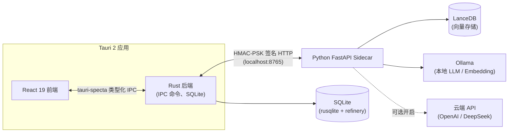

# FileMind

**桌面文件整理器 + RAG 知识问答** — 基于 Tauri 2 + React 19 + Python FastAPI Sidecar。

FileMind 是一款本地优先的桌面应用：通过规则引擎与启发式算法帮你自动整理文件，并基于检索增强生成（RAG）对文档进行自然语言问答。默认所有 AI 处理均在本地完成（Ollama）；云端推理需经过显式的知情同意流程后手动开启。

---

## 功能特性

- **首次启动引导** — 三步向导（推理模式 → 云端同意书 → 选择目录）
- **文件管理** — 目录扫描、虚拟滚动列表、分类/状态筛选、排序、右侧滑出预览抽屉（文本 / 图片 / PDF）
- **智能分类** — 规则引擎 + 启发式兜底 → 分类预览 → 带进度遮罩执行 → 24 小时撤销
- **RAG 知识问答** — SSE 流式回答、引用标签跳转源文件、多轮上下文
- **规则编辑** — 新建/编辑/删除/启用规则、拖拽排序优先级
- **设置** — 推理模式切换、Ollama 环境探测、Embedding 模型管理、亮色/暗色/跟随系统主题
- **系统托盘与单实例** — 关闭最小化到托盘、⌘1–⌘4 / ⌘, 页面导航快捷键（⌘⇧F 全局唤起窗口规划中）
- **全局错误边界** — 未捕获的渲染错误显示恢复界面，而非白屏

---

## 架构



- **前端**（`src/`）：React 19 + TypeScript + Zustand + React Router + Vite
- **后端**（`src-tauri/`）：Rust + Tauri 2，所有数据访问走原生 SQL（rusqlite），表结构由 refinery 迁移管理
- **AI Sidecar**（`python-sidecar/`）：FastAPI 服务，负责 RAG、分类、Embedding 与推理环境探测。Rust 层是**唯一**客户端——前端永远不直连 Sidecar。

---

## 技术栈

| 层       | 技术                                                  |
| -------- | ----------------------------------------------------- |
| 桌面外壳 | Tauri 2、Rust（≥ 1.97）                               |
| 前端     | React 19、TypeScript、Zustand、React Router 7、Vite 8 |
| 数据库   | SQLite（rusqlite）、FTS5 全文检索、refinery 迁移      |
| AI 服务  | Python FastAPI、LanceDB、Ollama、httpx                |
| 类型同步 | tauri-specta（Rust → TypeScript 自动生成）            |
| 测试     | Vitest、cargo test、pytest                            |

---

## 前置依赖

- **Node.js ≥ 24** 与 npm
- **Rust ≥ 1.97**（通过 [rustup](https://rustup.rs) 安装）
- **Python ≥ 3.x**
- **Ollama**（可选，本地推理所需）—— [安装](https://ollama.com/download)
- **Tauri CLI**（`cargo install tauri-cli@^2 --locked`）

---

## 快速开始

```bash
# 1. 初始化开发环境（安装依赖、venv、Tauri CLI）
bash scripts/bootstrap.sh

# 2. 启动完整应用（前端 + Tauri + Sidecar）
make dev
```

应用启动时先隐藏，前端就绪后自动显示。首次运行会进入引导向导。

---

## 开发命令

| 命令               | 说明                                                   |
| ------------------ | ------------------------------------------------------ |
| `make dev`         | 启动完整应用（`npm run dev:tauri`）                    |
| `make dev-web`     | 仅前端（Vite）                                         |
| `make dev-sidecar` | 仅 Python Sidecar（uvicorn :8765）                     |
| `make test`        | 前端 + Rust + Python 三层测试                          |
| `make build`       | 生产打包（`tauri build`）                              |
| `make lint`        | ESLint + Clippy + Ruff + mypy                          |
| `make format`      | Prettier + rustfmt + ruff format                       |
| `make gen-ipc`     | 从 Rust 重新生成 TypeScript 类型（`src/types/ipc.ts`） |
| `make install`     | 安装全部依赖                                           |
| `make testdata`    | 生成演示数据（初始化 DB + 生成文件）                   |
| `make clean`       | 清理构建产物                                           |

---

## 项目结构

```
filemind/
├── src/                    # React 19 + TypeScript 前端
│   ├── components/         #   layout / file / classify / chat / rules / settings / common
│   ├── pages/              #   FilesPage / ClassifyPage / ChatPage / RulesPage / SettingsPage
│   ├── stores/             #   Zustand stores（file / classify / chat / rule / settings）
│   ├── lib/                #   IPC 客户端、表格逻辑、主题、格式化
│   ├── hooks/              #   useHotkeys
│   ├── types/              #   ipc.ts（自动生成）+ models.ts
│   └── styles/             #   globals.css（CSS 变量、亮/暗主题）
├── src-tauri/              # Rust + Tauri 2 后端
│   └── src/
│       ├── commands/       #   IPC 命令（file / classify / chat / rules / config / inference）
│       ├── db/             #   数据仓库 + migrations/（refinery SQL，V001–V010）
│       ├── services/       #   分类器、日志链、撤销、冲突解决
│       ├── sidecar/        #   进程管理、代理、SSE 解析
│       └── security/       #   握手、钥匙串、路径守卫、模式切换
├── python-sidecar/         # FastAPI AI 服务
│   ├── app/
│   │   ├── api/            #   路由（chat / classify / index / search / inference / handshake）
│   │   ├── services/       #   RAG、重排、改写、自我纠正、Embedding
│   │   ├── rules/          #   规则引擎 + 预置规则
│   │   └── db/             #   LanceDB 数据仓库
│   └── tests/              #   pytest 测试套件
├── scripts/                #   bootstrap / build / CI 脚本
├── .github/                #   GitHub Actions 工作流
└── tests/                  #   前端集成测试配置
```

---

## 数据库

SQLite 是桌面端的唯一数据源。**Python Sidecar 永不访问数据库**——所有数据操作都走 Rust 层。

- 表结构变更仅通过 [refinery](https://github.com/rust-db/refinery) 迁移（`src-tauri/src/db/migrations/`）
- 布尔值存为 `INTEGER 0/1`，时间戳存为 ISO 8601 `TEXT`
- `operations_log` 使用 SHA-256 **链式哈希**保证防篡改：`chain_hash[i] = SHA256(chain_hash[i-1] || canonicalize(log[i]))`
- `operations_log` 仅允许插入（UPDATE 仅限 `status` 列，DELETE 由触发器禁止）

---

## 类型安全

IPC 类型通过 [tauri-specta](https://github.com/specy-build/tauri-specta) 从 Rust 自动生成：

```bash
make gen-ipc   # → src/types/ipc.ts（禁止手改）
```

每个命令都标注 `#[specta::specta]` 并返回 `Result<T, String>`。前端通过薄类型封装（`src/lib/ipc/`）调用。

---

## 安全设计

- **Sidecar 握手** — 请求带 HMAC-SHA256 签名与逐请求序号；PSK 存放在操作系统钥匙串（仅 Rust 层），永不落在前端或 Python 代码中
- **路径校验** — 所有文件路径都经过 `security::path_guard::validate()`（黑名单 + 路径穿越检查）
- **推理模式切换门** — 云端模式需先签署同意书；撤回同意自动切回本地
- **操作日志完整性** — 链式哈希、仅插入的审计轨迹
- **知情同意流程** — 云端推理需显式同意并展示隐私说明

---

## 测试

```bash
make test           # 运行全部三套测试
npm run test:unit   # Vitest（前端）
cargo test          # Rust 单元测试
pytest              # Python Sidecar 测试
```

---

## 开发规范

AI 开发工作流（小任务计划 → 审批 → 实现）与代码注释规范见 [AGENTS.md](./AGENTS.md)。

### Pre-commit 钩子

Husky + lint-staged + 自检脚本在每次提交时运行：

- ESLint + Prettier（TypeScript）
- Clippy（`-D warnings`）+ rustfmt（Rust）
- Ruff + mypy（Python）
- Conventional Commits 提交信息校验

### CI/CD

- **PR 检查**：lint + type-check + 单元测试 + 构建检查（3 平台）
- **合并构建**：4 个目标平台的完整构建（macOS arm64/x64、Windows x64、Linux x64）

---

## 关键约束

- Rust 中禁止 `unwrap()` / `expect()` / `panic!()`（默认 deny）
- TypeScript / Python 中禁止 `any` 类型
- 所有 IPC 命令使用 `#[specta::specta]` 并返回 `Result<T, String>`
- 所有文件路径必须经过 `path_guard::validate()`
- API 密钥 / PSK 存放在操作系统钥匙串，永不进入 Python Sidecar
- 数据库仅通过 Rust（rusqlite）访问；Sidecar 仅使用 LanceDB
