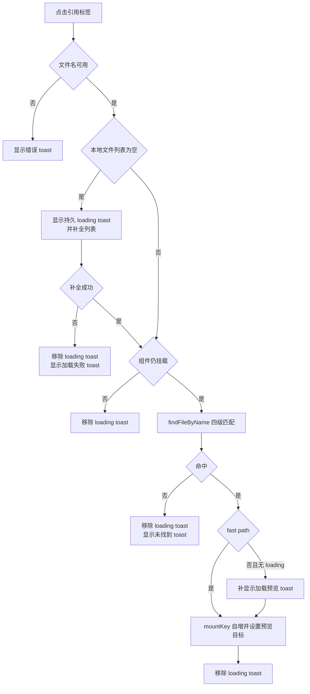
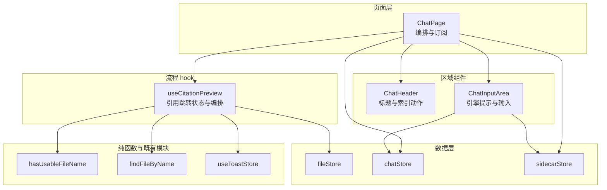
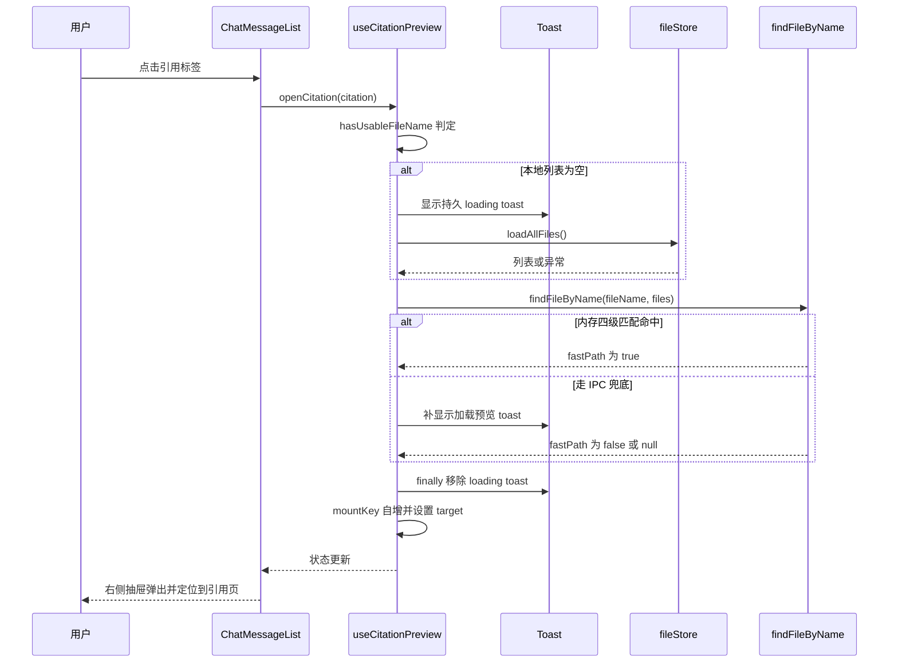

# ChatPage 引用流程与页面结构重构设计

## 1. 设计概述

### 1.1 目的与范围

本设计针对 `src/pages/ChatPage.tsx` 的一次结构重构：把「点击引用 → 定位文件 → 打开预览抽屉」这条流程，以及页面头部与输入区，从页面组件中拆成独立模块。目标是让页面本体回到函数复杂度阈值以内，并让这条流程的失败路径能被单独测试。

覆盖范围是 `src/pages/ChatPage.tsx` 与它直接依赖的四个新模块：一个自定义 hook、一个纯函数补充、两个展示组件。

不在本次范围内：问答链路本身（`stores/chatStore` 及其 `stores/chat/` 子模块）、消息渲染（`ChatMessageList`、`ChatBubble`、`CitationChip`）、检索状态栏（`SearchStatusBar`）、建立索引的后端实现。这些模块的职责与对外接口保持不变。

### 1.2 上游依据

仓库里不存在针对本次改造的需求文档，本设计要满足的「需求」来自工程门禁与实测数据，均可从仓库直接核验。

| 依据位置               | 内容                                                                                                         | 证据          |
| ---------------------- | ------------------------------------------------------------------------------------------------------------ | ------------- |
| `rules/complexity.md`  | 函数圈复杂度强制 15、警告 10；文件行数档位为页面 400/300、组件 300/200、`.ts` 250/150                        | [Data-backed] |
| `eslint.config.js`     | `src/pages/ChatPage.tsx` 登记了 `complexity: ['error', 19]` 的历史欠账覆盖块                                 | [Data-backed] |
| 本机实测（2026-09-16） | `ChatPage.tsx` 294 行；`ChatPage` 复杂度 15，`handleCitationClick` 复杂度 19、占 83 行                       | [Data-backed] |
| 既有同类改造           | ClassifyPage 由 38 降到 9 并删除豁免（提交 `f5aaeef`、`27ef0dc`）                                            | [Data-backed] |
| `vite.config.ts`       | 覆盖率门禁 lines 80 / functions 78 / branches 75 / statements 80；最近一次实测 83.35 / 80.89 / 77.85 / 84.18 | [Data-backed] |

### 1.3 约束

现有 10 条 `ChatPage.test.tsx` 用例（其中一条用 `StrictMode` 包裹，盯住卸载守卫的写法）在不改动的前提下必须继续通过 [Data-backed]。重构不改变界面：类名、DOM 结构、文案与交互时序都保持原样 [Expert judgment]。不引入新依赖，组件沿用具名导出，不使用 `any` [Data-backed]。抽屉的挂载 key 语义（每次打开自增，迫使 react-pdf 的 `Document`/`Page` 彻底重挂载）属于既有行为，需原样保留 [Data-backed]。

### 1.4 术语

| 术语          | 含义                                                                       |
| ------------- | -------------------------------------------------------------------------- |
| 引用跳转      | 用户点击回答气泡里的引用标签后，定位到对应文件并打开右侧预览抽屉的整条流程 |
| fast path     | 文件名在本地 `fileStore` 列表中命中，四级内存匹配耗时低于 1ms              |
| 慢路径        | 内存未命中后走 `searchByFilename` 的 IPC 模糊搜索，带 3s 超时保护          |
| loading toast | 慢路径期间显示的持久提示，`duration: 0` 表示不自动关闭，需显式移除         |
| mountKey      | 抽屉的挂载 key，自增即强制卸载旧实例、清掉 PDF 缓存                        |

## 2. 现状分析

### 2.1 复杂度与行数分布

页面文件 294 行，函数复杂度分布如下。除了引用流程，其余函数都留有充足余量。

| 位置                                                  | 当前复杂度 | 行数规模 |
| ----------------------------------------------------- | ---------- | -------- |
| `handleCitationClick`（第 109 行起的 async 箭头函数） | 19         | 83       |
| `ChatPage` 本体                                       | 15         | 165      |
| `handleBuildIndex`                                    | 6          | 20       |
| 启动兜底 effect                                       | 4          | 10       |
| 引擎失败选择器箭头                                    | 2          | 1        |

### 2.2 引用跳转的现有控制流



流程里有五条退出路径：文件名不可用、列表补全失败、组件已卸载、文件未找到、命中成功。每条路径都要求清理同一个持久 toast，这正是复杂度集中的原因。

### 2.3 三个待解问题

复杂度登记只是表层，这条流程还存在一个真实缺陷和一个余量问题。

**复杂度集中在单个函数。** 19 的复杂度里，约一半来自五条退出路径各自的判断与清理，另一半来自 `try/catch` 的嵌套。判断本身都不复杂，堆在一起才超限。

**持久 toast 在最外层异常路径上不会消失。** 清理动作以 `if (loadingToastId) removeToast(loadingToastId)` 的形式手写了五处，覆盖了四条退出路径，唯独外层 `catch` 没有清理 [Data-backed]。而 loading toast 的 `duration` 为 0，按 `Toast.tsx` 的行为不会自动关闭。触发条件是 `findFileByName` 抛错——典型场景是兜底 IPC 超时后抛出，此时页面上会永久留一条「正在定位…」提示，用户只能刷新页面。

**页面本体没有余量。** `ChatPage` 本体复杂度为 15，恰好等于强制阈值。任何一次在 JSX 里新增 `&&` 或三元（例如再加一个条件按钮）都会直接让 CI 失败，而报错信息指向的是组件而不是新增的那一行。

## 3. 目标结构

### 3.1 模块结构



页面层只保留订阅与编排：它从 `chatStore`、`fileStore`、`sidecarStore` 取状态，把 `messages`、`isStreaming` 交给消息区，把索引状态与动作交给头部，把引擎状态与发送动作交给输入区，把预览目标与关闭动作交给抽屉。引用跳转的全部判断与 toast 生命周期收在 `useCitationPreview` 里，页面只拿到 `mountKey`、`target`、`openCitation`、`close` 四个出口。

### 3.2 模块职责

| 模块                 | 职责                                                   | 输入                                                                  | 输出                                          | 依赖                                                                | 边界                                                                |
| -------------------- | ------------------------------------------------------ | --------------------------------------------------------------------- | --------------------------------------------- | ------------------------------------------------------------------- | ------------------------------------------------------------------- |
| `ChatPage`           | 组装页面：订阅三个 store，把状态与动作分发给区域组件   | 无 props；从 store 读                                                 | 页面 DOM                                      | `ChatHeader`、`ChatInputArea`、`useCitationPreview`、三个 store     | 不做引用匹配、不做 toast 管理、不持有索引结果以外的 UI 状态         |
| `useCitationPreview` | 完成一次引用跳转：定位文件、管理过程提示、设置预览目标 | `ChatCitation`                                                        | `mountKey`、`target`、`openCitation`、`close` | `hasUsableFileName`、`findFileByName`、`useToastStore`、`fileStore` | 不渲染任何 DOM，不感知 `ChatMessageList` 的存在                     |
| `ChatHeader`         | 渲染页面头部并在用户触发动作时上报意图                 | `totalFiles`、`showClearHistory`、`index` 对象、`onClearHistory`      | 头部 DOM                                      | 无（纯展示）                                                        | 不订阅 store，不发起 IPC，索引结果提示由注入的 `index.message` 决定 |
| `ChatInputArea`      | 把引擎状态与发送中的组合结果转成输入区的可用性         | `engineReady`、`engineFailed`、`streaming`、`onRetryEngine`、`onSend` | 底部 DOM                                      | `ChatInput`                                                         | 不订阅 store，不发起 IPC，禁用态由传入的两个布尔值组合得出          |
| `hasUsableFileName`  | 判定引用的文件名是否可用                               | `ChatCitation \| null \| undefined`                                   | 布尔值                                        | 无                                                                  | 不做大小写或后缀的规范化，那是匹配函数的职责                        |

每个模块都能用一句话说清职责，没有出现「既做 A 又做 B」的模块，依赖方向为页面层 → 区域组件/hook → 纯函数与 store，不存在反向引用。

### 3.3 页面本体的复杂度去向

拆出引用流程与两个区域后，`ChatPage` 只剩三处条件渲染：错误条、空态与消息列表的二选一、抽屉的 `initialPage` 条件透传。三处合计 4 个分支，加上函数本身，复杂度预计落在 5 附近 [Hypothesis]。

## 4. 关键接口

### 4.1 useCitationPreview

```ts
interface CitationPreviewTarget {
  file: FileInfo;
  initialPage: number;
}

function useCitationPreview(): {
  /** 打开引用：void 包装，可直接作为 ChatMessageList 的 onCitationClick */
  openCitation: (citation: ChatCitation) => void;
  /** 关闭预览抽屉 */
  close: () => void;
  /** 抽屉挂载 key，每次打开自增 */
  mountKey: number;
  /** 当前预览目标，null 表示抽屉关闭 */
  target: CitationPreviewTarget | null;
};
```

`openCitation` 以 `useCallback` 固定引用，依赖只有 `fileStore.loadAllFiles`。这一点是硬约束：`ChatMessageList` 内部的 `ChatBubble` 做了记忆化，回调引用若每次渲染都变，记忆化会失效，流式输出时整列气泡会跟着重渲 [Data-backed]。

### 4.2 openCitation 的出口路径

五条路径的判断与提示语义保持一致，差别只在清理方式：原先每处手写移除，改为 `try/finally` 统一收尾。

| 出口路径     | 触发条件                           | 用户可见结果                                       |
| ------------ | ---------------------------------- | -------------------------------------------------- |
| 文件名不可用 | 引用缺失或 `fileName` 为空         | 错误 toast，不发任何 IPC                           |
| 列表补全失败 | 本地列表为空且 `loadAllFiles` 抛错 | 移除 loading toast，随后显示加载失败 toast         |
| 组件已卸载   | 任一 `await` 期间组件卸载          | 移除 loading toast，不设置状态                     |
| 文件未找到   | 四级匹配与 IPC 兜底均未命中        | 移除 loading toast，显示未找到提示并引导去扫描目录 |
| 命中         | 内存命中或 IPC 命中                | 移除 loading toast，自增 `mountKey` 并设置预览目标 |

未列举的异常（例如匹配函数抛出非超时错误）进入外层 `catch`：显示打开失败 toast，并由 `finally` 移除 loading toast。这一条是本次唯一的行为变化，见 5.2。

### 4.3 展示组件接口

```ts
interface ChatHeaderProps {
  /** 已索引文件数，展示在标题右侧 */
  totalFiles: number;
  /** 是否显示清空对话按钮（有消息时显示） */
  showClearHistory: boolean;
  /** 索引区块的状态与动作 */
  index: {
    building: boolean;
    message: string | null;
    ready: boolean;
    onBuild: () => void;
  };
  onClearHistory: () => void;
}

interface ChatInputAreaProps {
  engineReady: boolean;
  engineFailed: boolean;
  streaming: boolean;
  onRetryEngine: () => void;
  onSend: (content: string) => void;
}
```

`ChatHeader` 接收一个 `index` 对象而不是四个平行 props，是因为这四个值同属「索引动作」这一件事，放在一起后组件签名从七个参数降到四个 [Expert judgment]。两个组件都不订阅 store，状态由页面注入，这样它们的测试不需要构造 store。

### 4.4 hasUsableFileName

```ts
function hasUsableFileName(citation: ChatCitation | null | undefined): boolean;
```

判定规则是 `fileName` 为非空字符串。它替代原先内联在流程里的三重判断，放在 `src/lib/citation.ts` 与 `findFileByName` 同处一个模块，因为两者处理的是同一份输入 [Expert judgment]。

### 4.5 引用跳转时序



图中「走 IPC 兜底」分支对应慢路径：`findFileByName` 内部对 `searchByFilename` 加了 3s 超时，超时后抛出，由 hook 的外层 `catch` 兜住并显示打开失败提示；无论走哪条分支，`finally` 都会移除持久 toast [Data-backed]。

## 5. 改造影响与实施顺序

### 5.1 受影响文件

| 文件                                                                | 类型 | 变化                                                        |
| ------------------------------------------------------------------- | ---- | ----------------------------------------------------------- |
| `src/hooks/useCitationPreview.ts`                                   | 新增 | 引用跳转流程，约 130 行，各函数复杂度不超过 10 [Hypothesis] |
| `src/hooks/useCitationPreview.test.tsx`                             | 新增 | 覆盖 4.2 表中的五条路径与卸载守卫                           |
| `src/components/chat/ChatHeader.tsx`                                | 新增 | 头部区域，约 70 行 [Hypothesis]                             |
| `src/components/chat/ChatInputArea.tsx`                             | 新增 | 底部区域，约 55 行 [Hypothesis]                             |
| `src/components/chat/ChatHeader.test.tsx`、`ChatInputArea.test.tsx` | 新增 | 渲染与回调断言                                              |
| `src/lib/citation.ts`                                               | 修改 | 增加 `hasUsableFileName`，配 `citation.test.ts` 的用例      |
| `src/pages/ChatPage.tsx`                                            | 修改 | 294 行降到约 175 行，复杂度 15 降到约 5 [Hypothesis]        |
| `eslint.config.js`                                                  | 修改 | 删除 `ChatPage.tsx` 的复杂度豁免块                          |
| `rules/complexity.md`                                               | 修改 | 欠账表移除该条，并入「已消账」注脚                          |

### 5.2 行为变化点

唯一的行为变化是 2.3 提到的 toast 泄漏被修掉。修法是把五处手写清理合并为 `try/finally`，异常路径因此也会移除持久 toast。用户可见的差别只有一种情况：先前 `findFileByName` 抛错时会残留「正在定位…」，现在它会消失，只剩打开失败的提示。这个变化会由 `useCitationPreview.test.tsx` 中的异常路径用例盯住。

其余行为按原样保留：四级匹配顺序不变，fast path 不显示额外 toast，慢路径补显示加载预览提示，未找到时引导去文件管理扫描目录，卸载后不再设置需要卸载守卫的状态 [Data-backed]。StrictMode 的教训同样保留——挂载守卫必须在 effect 的 setup 里显式置为已挂载，只写 cleanup 会让 ref 从挂载起永久为 false，导致点击引用静默返回 [Data-backed]。

### 5.3 实施顺序

先补 `hasUsableFileName` 与它的用例，这一步不动页面。接着写 `useCitationPreview` 与它的用例，此时页面还没接入，两边可以分别验证。

然后把页面切到 hook，并确认四条既有引用相关用例仍然通过——这一步做完，引用流程的复杂度就离开了页面文件。最后拆 `ChatHeader` 与 `ChatInputArea`，把页面本体压到只剩编排，再删除 `eslint.config.js` 里的豁免块。

顺序上先删豁免再拆组件会让中间状态无法通过 lint，因此豁免在最后一步删除 [Expert judgment]。

### 5.4 验证与回滚

验证按仓库既有门禁顺序执行：`npm run lint`（`--max-warnings 0`，复杂度 15 生效）通过后再删豁免；`npm run type-check`；`scripts/check-file-size.sh` 应报 FAIL 0，且 `ClassifyPage` 已掉出警告档之后，`ChatPage` 同样应落在 300 行警告线以内；`npm run test:coverage` 要求全部用例通过且覆盖率不低于 lines 80 / functions 78 / branches 75 / statements 80；最后 `npx vite build` 确认产物可构建。

回滚成本低：改动集中在页面与四个新模块，`eslint.config.js` 与 `rules/complexity.md` 的修改可单独 revert；不存在数据库或接口层面的变更 [Expert judgment]。

实施记录（2026-09-16）：按 5.3 的顺序落地，与预期的差异有两处。`ChatPage` 收敛到 159 行、复杂度 7（预期约 175 行、约 5）；`useCitationPreview` 为 149 行、最大函数复杂度 11（预期约 130 行、不超过 10），超出预期的那部分来自「列表补全」与「匹配」两级 await 各自的卸载守卫。其余结果一致：`eslint.config.js` 中该文件的豁免块已删除，文件行数门禁报 FAIL 0、WARN 39，`ChatPage` 掉出警告档。测试文件由 58 个增至 61 个，既有 10 条断言未改动即通过，新增 25 条用例；覆盖率 statements 84.4 / branches 78.92 / functions 81.23 / lines 85.24，`ChatPage` 自身由 70.83 升到 89.65。2.3 描述的持久 toast 泄漏按 5.2 的方式修复，并由 hook 测试中的异常路径用例覆盖。
