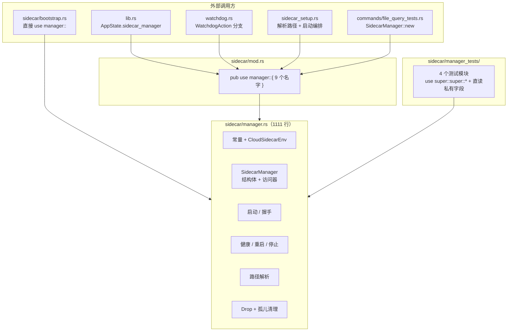
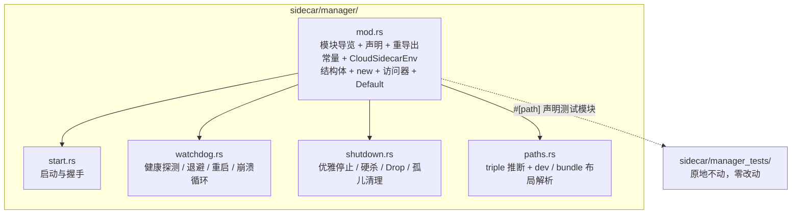

# Sidecar Manager 模块拆分设计

## 1. 设计概述

### 1.1 目的与范围

本设计把 `src-tauri/src/sidecar/manager.rs`（1111 行）按职责拆成 `sidecar/manager/` 目录下的五个模块，使它脱离行数门禁基线。拆分只做「搬家 + 最小可见性放宽」，不改任何运行逻辑。

覆盖范围是 `manager.rs` 自身、它的子模块声明方式，以及 `scripts/file-size-baseline.txt` 中对应条目的消账。不在本次范围内：`sidecar/` 下的 `bootstrap.rs`、`platform.rs`、`proxy.rs`、`sse.rs`（各自独立，保持不变），sidecar 的启动时序、握手协议、watchdog 策略与孤儿清理算法。

### 1.2 上游依据

本次没有产品需求文档，设计要满足的「需求」来自行数门禁与既有工程约束，均可从仓库直接核验。

| 依据位置                         | 内容                                                                                                                                      | 证据          |
| -------------------------------- | ----------------------------------------------------------------------------------------------------------------------------------------- | ------------- |
| `rules/complexity.md`            | Rust 文件行数：强制 500 / 警告 300                                                                                                        | [Data-backed] |
| `scripts/file-size-baseline.txt` | 登记 `src-tauri/src/sidecar/manager.rs 1111`，属「基线内待消账」                                                                          | [Data-backed] |
| 同文件修订记录                   | 该文件 1086 → 1111 的增长来自早先合并的 `fix/windows-sidecar-runtime`，为遗留欠账，「一并消账以免阻塞后续 dev → main 的 PR」              | [Data-backed] |
| 既有同类拆分                     | `db/file_repo.rs` 638 行 → 目录模块，最大 164 行，调用方与测试均未改动（提交 `4e76d01`）                                                  | [Data-backed] |
| 既有同类拆分                     | `commands/file_ops.rs` 1395 行 → 目录模块，最大 289 行（提交 `cc9eb0d`）；`main.rs` 703 行 → 5 个 bin 模块，最大 172 行（提交 `b678519`） | [Data-backed] |

### 1.3 约束

对外调用面必须逐字不变：`sidecar/mod.rs` 当前把 9 个名字从 `manager` 重导出（`cleanup_orphan_sidecar`、`current_target_triple`、`resolve_bundle_binary_path`、`resolve_bundle_from_resources`、`resolve_dev_binary_path`、`CloudSidecarEnv`、`SidecarManager`、`WatchdogAction`、`SIDECAR_PORT`），四个外部文件的引用方式（`lib.rs` 的 `AppState` 字段、`watchdog.rs` 的动作匹配、`sidecar_setup.rs` 的启动编排、`commands/file_query_tests.rs` 的构造）都不得改动 [Data-backed]。

`manager_tests/` 下的四个测试模块与夹具零改动，它们以 `use super::super::*` 通配导入 `manager` 的项、并直接读写 `SidecarManager` 的私有字段 [Data-backed]。这意味着结构体的定义位置与私有项的可见范围都受测试约束，见第 4 章。

### 1.4 术语

| 术语         | 含义                                                                         |
| ------------ | ---------------------------------------------------------------------------- |
| onedir 产物  | PyInstaller 目录形态的 Sidecar（主可执行 + `_internal/`），P2-2 起的打包形态 |
| dev 布局     | 开发态从 `CARGO_MANIFEST_DIR` 回退到 repo 根的 `filemind/binaries/` 定位产物 |
| bundle 布局  | 打包态从 Tauri `resource_dir()` 或主可执行目录定位 `sidecar/` 子目录         |
| 崩溃循环     | 60s 窗口内重启超过 10 次后暂停自动恢复的状态                                 |
| 孤儿 Sidecar | 上次异常退出后被 init 收养（`ppid==1`）仍占住端口的残留进程                  |

## 2. 现状分析

### 2.1 段落剖面

文件 1111 行，按职责可分为七段。其中「路径解析」「孤儿清理」两段与进程生命周期无关，可独立成模块。

| 行段      | 内容                                                                                                   | 行数 |
| --------- | ------------------------------------------------------------------------------------------------------ | ---- |
| 1-56      | 模块文档 + 10 个常量（端口、就绪轮询、健康阈值、退避、崩溃循环、优雅停止）                             | 56   |
| 58-77     | `CloudSidecarEnv`（云端模式 env 注入）                                                                 | 20   |
| 78-105    | `SidecarManager` 结构体（8 个字段）                                                                    | 28   |
| 108-176   | 构造 `new` + 7 个访问器                                                                                | 69   |
| 177-374   | 启动链路：`start`、`wait_ready`、`handshake`、`start_with_handshake`、`abort_failed_start`、`try_wait` | 198  |
| 375-632   | 健康与重启：`health_check`、`watchdog_tick`、`next_backoff`、`restart`、`record_restart`、崩溃循环判定 | 258  |
| 633-659   | `WatchdogAction` + `impl Default`                                                                      | 27   |
| 660-939   | 路径解析：triple 推断 + dev 布局 + bundle 布局                                                         | 280  |
| 940-952   | `impl Drop`                                                                                            | 13   |
| 954-1104  | 孤儿清理：`matches_sidecar_comm` + `cleanup_orphan_sidecar`                                            | 151  |
| 1106-1111 | 测试模块声明 + lint 备注                                                                               | 6    |

### 2.2 现状依赖关系



外部只经 `sidecar::manager::` 这一个路径访问（`bootstrap.rs` 直接 `use crate::sidecar::manager::{...}`，其余走 `sidecar` 的重导出）。测试模块是 `manager` 的子模块，因此能通配导入其私有项并直接读写结构体私有字段——这是拆分的硬约束来源。

### 2.3 四个待解问题

**文件已进入「只许变小」的冻结状态。** 基线把上限锁在 1111 行，任何在该文件内新增代码的改动都会被 CI 判 FAIL，即使是必要的。修订记录显示，先前一次合并正是因为没同步基线，把 1086 顶到 1111 后「一并消账以免阻塞后续 dev → main 的 PR」[Data-backed]。这已经不是整洁度问题，而是后续改动的通行成本。

**六组职责混在一个文件。** 路径解析（280 行）与孤儿清理（151 行）合计 431 行与进程生命周期无关：前者是纯函数（接收根目录列表，返回可执行路径），后者是「查端口占用 + 匹配进程身份 + 判断孤儿」的外壳命令封装。它们与 `start` / `watchdog_tick` 放在一起，只因为最初写在同一文件里。

可见性依赖与测试耦合是第三条。测试直接访问 `consecutive_failures`、`process`、`psk` 三个私有字段，并调用 `abort_failed_start`（私有方法）、`next_backoff`、`stop_graceful`、`watchdog_tick` 等方法 [Data-backed]。拆分时若把结构体挪进子模块，字段就从测试模块的可见范围里消失；这是 §1.3 约束的具体落点。

**子模块声明方式是既有陷阱。** 文件末尾的注释已经记下这个坑：「`manager.rs` 非 `mod.rs` 文件，`mod x;` 默认找 `manager/x.rs` 而非同级目录」，因此当前用 `#[path = "manager_tests/mod.rs"]` 指过去 [Data-backed]。文件转成 `mod.rs` 后该相对路径的基准目录会变，必须同步修改，否则测试模块静默丢失（编译能过、测试不跑）。

## 3. 目标结构

### 3.1 目录模块结构



`mod.rs` 是唯一的门面：它声明四个子模块、把它们的公开项 `pub use` 出来，使 `sidecar::manager::X` 的所有既有路径继续成立（`mod.rs` 与 `manager` 模块同名同址，路径字符串不变，这正是 `file_repo/` 已经验证过的做法）。子模块之间没有横向依赖：`start` / `watchdog` / `shutdown` 各自 `impl SidecarManager`，方法集合跨文件拼在同一个类型上，方法间调用走 `self.`，不产生模块引用 [Expert judgment]。

### 3.2 模块职责与边界

| 模块          | 职责                                                                                     | 依赖                                                 | 边界                                                       |
| ------------- | ---------------------------------------------------------------------------------------- | ---------------------------------------------------- | ---------------------------------------------------------- |
| `mod.rs`      | 定义类型与模块门面：`SidecarManager` 的全部状态、构造、只读访问器与默认值                | 四个子模块                                           | 不含任何进程操作；不发起 spawn / 请求 / kill               |
| `start.rs`    | 把进程拉起来并完成身份验证：spawn（含 PSK 经 stdin 注入）、就绪轮询、握手、失败回滚      | `security::handshake`、`proxy`、常量                 | 不做健康监测与重启决策，那是 watchdog 的职责               |
| `watchdog.rs` | 判断进程是否还活着并决定动作：`/health` 探测、失败计数、指数退避、重启、崩溃循环窗口统计 | `start` 的启动能力（经 `self.start_with_handshake`） | 不直接杀进程；重启的落地动作由 `start` 与 `shutdown` 提供  |
| `shutdown.rs` | 结束进程并回收残留：优雅停止（请求退出 → 等待 → 硬杀）、`Drop` 兜底、孤儿进程清理        | 常量、外部命令 `lsof` / `ps` / `kill`                | 不判断何时该停（调用方决定），只负责停得干净               |
| `paths.rs`    | 解析 Sidecar 可执行文件位置：triple 推断、dev 布局发现、bundle 布局探测                  | `AppError`、文件系统                                 | 不 spawn、不改状态；纯函数为主，输入是环境变量与根目录列表 |

单句职责检查通过：每个模块都能用一句话说清，没有出现「既做 A 又做 B」的模块。`paths.rs` 与 `shutdown.rs` 之间也没有依赖——路径解析不知道孤儿清理的存在。

### 3.3 依赖方向

`sidecar/mod.rs` → `manager/mod.rs` → 四个子模块 → `crate::error` / `crate::security` / `crate::sidecar::proxy`。子模块不反向引用 `mod.rs` 的私有项，`mod.rs` 也不调用子模块的私有函数，依赖图无环 [Expert judgment]。

## 4. 接口与可见性契约

### 4.1 结构体与字段

`SidecarManager` 及其 8 个字段**必须定义在 `manager/mod.rs`**。Rust 的私有可见性覆盖「定义模块及其后代模块」，`manager_tests` 是 `manager` 的子模块，因此只有把结构体放在 `mod.rs`，测试对其私有字段的读写才继续成立 [Expert judgment]。若把结构体挪进子模块（例如 `state.rs`），测试模块就成了非后代，字段可见性立即失效。

字段与访问器保持现状：`binary_path_`、`process`、`port`、`cloud_env`、`psk`、`recent_restarts`、`consecutive_failures`、`recent_health_fails`、`stopped` 均不变；`new`、`binary_path`、`binary_path_inner`（`#[cfg(test)] pub(crate)`）、`is_stopped`、`psk`、`pid`、`set_cloud_env`、`cloud_env`、`impl Default` 同样留在 `mod.rs`。因 `cloud_env` 字段需要类型，`CloudSidecarEnv` 也定义在 `mod.rs`。

### 4.2 常量归属

| 常量                                                     | 归属                        | 理由                                                                                           |
| -------------------------------------------------------- | --------------------------- | ---------------------------------------------------------------------------------------------- |
| `SIDECAR_PORT`                                           | `mod.rs`                    | 已由 `sidecar/mod.rs` 重导出，且 `new` 与 `cleanup_orphan_sidecar` 都读                        |
| `MAX_READY_ATTEMPTS`、`READY_POLL_INTERVAL_MS`           | `mod.rs`                    | 启动时序、跨 start 与文档引用                                                                  |
| `HEALTH_FAIL_THRESHOLD`                                  | `mod.rs`                    | watchdog 阈值，测试直接引用                                                                    |
| `RESTART_BACKOFF_BASE_MS`、`RESTART_BACKOFF_CAP_MS`      | `mod.rs`                    | 测试用 `use super::super::*` 通配导入，留在 `mod.rs` 零改动                                    |
| `CRASH_LOOP_WINDOW_SECS`、`CRASH_LOOP_MAX_RESTARTS`      | `mod.rs`                    | 同上                                                                                           |
| `GRACEFUL_SELF_EXIT_SECS`、`GRACEFUL_TOTAL_TIMEOUT_SECS` | `mod.rs`                    | 停止时序，与 `SIDECAR_PORT` 同属对外可观测契约                                                 |
| `BUNDLE_SIDECAR_SUBDIR`                                  | `paths.rs`，标 `pub(super)` | 与 bundle 布局强相关；`pub(super)` 使它在 `manager` 及其后代（含测试模块）可见，通配导入仍成立 |

### 4.3 方法与函数归属

| 目标文件      | 内容                                                                                                                                           | 可见性                                                             |
| ------------- | ---------------------------------------------------------------------------------------------------------------------------------------------- | ------------------------------------------------------------------ |
| `mod.rs`      | `new`、`binary_path`、`binary_path_inner`、`is_stopped`、`psk`、`pid`、`set_cloud_env`、`cloud_env`、`impl Default`                            | 保持现状                                                           |
| `start.rs`    | `start`、`wait_ready`、`handshake`、`start_with_handshake`、`try_wait`                                                                         | 保持 `pub`                                                         |
| `start.rs`    | `abort_failed_start`                                                                                                                           | 由私有放宽为 `pub(super)`（测试直接调用）                          |
| `watchdog.rs` | `health_check`、`watchdog_tick`、`restart`、`is_crash_loop_paused`、`restart_count_in_window`                                                  | 保持 `pub`                                                         |
| `watchdog.rs` | `next_backoff`                                                                                                                                 | 保持 `pub`（测试调用）                                             |
| `watchdog.rs` | `record_restart`                                                                                                                               | 保持私有（仅本文件与 watchdog 流程使用）                           |
| `watchdog.rs` | `WatchdogAction`                                                                                                                               | `pub`，由 `mod.rs` 重导出以维持 `sidecar::manager::WatchdogAction` |
| `shutdown.rs` | `stop_graceful`、`stop_hard`                                                                                                                   | 保持 `pub`                                                         |
| `shutdown.rs` | `impl Drop for SidecarManager`                                                                                                                 | 与 `stop_hard` 同文件（`Drop` 只在未 stopped 时调它）              |
| `shutdown.rs` | `matches_sidecar_comm`、`cleanup_orphan_sidecar`                                                                                               | 保持 `pub(crate)` / `pub`                                          |
| `paths.rs`    | `current_target_triple`、`resolve_dev_binary_path`、`resolve_bundle_from_roots`、`resolve_bundle_from_resources`、`resolve_bundle_binary_path` | 保持 `pub`                                                         |
| `paths.rs`    | `resolve_override`、`find_in_dev_layout`、`probe_onedir`、`is_existing_file`、`resolve_main_exe_names`                                         | 保持私有（均在 `paths` 内自洽使用）                                |
| `paths.rs`    | `main_exe_base_name`、`main_exe_in_dir`                                                                                                        | 保持 `const fn` / `pub(crate)`                                     |

可见性变更只有一处：`abort_failed_start` 由 `fn` 变为 `pub(super) fn`（仍在 crate 内，不进对外 API）。这是拆分的必要代价——测试要调它，而它不再与测试模块同属一个模块 [Expert judgment]。

### 4.4 测试模块接线

`manager_tests/` 目录与四个测试文件**原地不动**，`support.rs` 也无需调整。`mod.rs` 中的声明改为：

```rust
#[cfg(test)]
#[path = "../manager_tests/mod.rs"]
mod manager_tests;
```

路径基准从「`sidecar/` 目录」变为「`sidecar/manager/` 目录」，因此从 `manager_tests/mod.rs` 改为 `../manager_tests/mod.rs`；上方那条解释 `#[path]` 必要性的注释同步改写（原文按 `manager.rs` 是普通文件来叙述，转换后不再成立）。`db/file_repo/mod.rs` 用 `#[path = "../file_repo_tests.rs"]` 引用同级测试文件，是同一个手法 [Data-backed]。

测试文件内的 `use super::super::*` 语义不变：`manager_tests` 仍是 `manager` 的后代（`manager::manager_tests`），`super::super` 仍解析到 `manager`。

### 4.5 对外调用面

`sidecar/mod.rs` 的 9 个重导出逐字保持，`bootstrap.rs`、`lib.rs`、`watchdog.rs`、`sidecar_setup.rs`、`commands/file_query_tests.rs` 五个文件的引用零改动。这是由于 `mod.rs` 把子模块的公开项再次 `pub use`（`pub use paths::{...}`、`pub use start::...` 不适用——方法是 `impl` 块的成员，随类型定义可见性生效，无需重导出）[Expert judgment]：类型与常量需要重导出，方法只要 `impl` 块在 crate 内且方法本身 `pub`，就自动对调用方可见。

## 5. 改造影响与实施顺序

### 5.1 受影响文件

| 文件                                                  | 类型 | 变化                                                                            |
| ----------------------------------------------------- | ---- | ------------------------------------------------------------------------------- |
| `src-tauri/src/sidecar/manager.rs` → `manager/mod.rs` | 改造 | 保留文档、声明、常量、类型、访问器、`Default`、测试声明，约 200 行 [Hypothesis] |
| `src-tauri/src/sidecar/manager/start.rs`              | 新增 | 启动与握手 6 个函数，约 230 行 [Hypothesis]                                     |
| `src-tauri/src/sidecar/manager/watchdog.rs`           | 新增 | 健康与重启 8 项，约 215 行 [Hypothesis]                                         |
| `src-tauri/src/sidecar/manager/shutdown.rs`           | 新增 | 停止、`Drop`、孤儿清理，约 265 行 [Hypothesis]                                  |
| `src-tauri/src/sidecar/manager/paths.rs`              | 新增 | 路径解析 13 项，约 290 行 [Hypothesis]                                          |
| `scripts/file-size-baseline.txt`                      | 修改 | 删除 `src-tauri/src/sidecar/manager.rs 1111` 条目并追加修订记录                 |
| `src-tauri/src/sidecar/manager_tests/*`               | 不变 | 仅依赖 §4.1 与 §4.4 两条契约                                                    |

除上述外无其他文件改动；`sidecar/mod.rs` 与其四个外部调用方均保持原样。

### 5.2 实施顺序

先把 `manager.rs` 转成 `manager/mod.rs` 并改好测试模块的 `#[path]`，此时只有声明方式变化，编译与测试应全绿——这一步把 §2.3 的第四个坑先钉死，避免后续拆文件时混淆「是拆坏了还是声明写错了」。

然后按依赖从少到多依次搬：`paths.rs`（纯函数，无 `self`）、`shutdown.rs`（依赖常量与类型）、`start.rs`、`watchdog.rs`（内部会调 `start` 的方法）。每搬一个文件跑一次 `cargo clippy` 与 `cargo test`；可见性放宽只应出现在编译报错明确指出的那一处，多出来的放宽即为设计问题。

最后删除基线条目并更新修订记录。顺序上先删条目会立刻让门禁在中间状态 FAIL（文件仍超限），因此基线在最后一步改 [Expert judgment]。

### 5.3 验证

Rust 侧按仓库门禁执行：`cargo clippy --manifest-path src-tauri/Cargo.toml -- -D warnings`、`cargo test --manifest-path src-tauri/Cargo.toml`（`manager_tests` 下 4 个模块是主要回归网，覆盖退避、崩溃循环、幂等停止、孤儿清理、路径探测）、`bash scripts/check-file-size.sh` 应报 FAIL 0 且「基线内待消账」由 2 条降为 1 条（只剩 `globals.css`）。

因为动的是启动链路，额外做一次实机确认：`npm run dev:tauri` 启动后窗口秒开、状态栏进入「AI 引擎就绪」，退出应用后 `pgrep -f filemind-sidecar` 无残留进程（验证 `Drop` 兜底与孤儿清理仍生效）。前端与 Python 侧无代码改动，如需完整门禁可另跑 `make lint`。

### 5.4 回滚

改动集中在一个 Rust 目录模块与一行基线，单个提交即可回滚（`git revert` 恢复 `manager.rs` 与基线条目），不存在数据迁移或对外协议变更 [Expert judgment]。

实施记录（2026-09-16）：按 5.2 的顺序落地，编译与测试通过；与设计有四处偏差，均为实施中发现的细节。

实际行数：`mod.rs` 221、`paths.rs` 298、`shutdown.rs` 275、`start.rs` 216、`watchdog.rs` 196（设计预估 ~200 / ~290 / ~265 / ~230 / ~215，合计 1206 行，比原 1111 行多出的部分是新增的模块文档、导入与 `impl` 包装）。`paths.rs` 距 300 行警告线只剩 2 行，后续若在该文件增加内容需先拆出 bundle 部分。

测试文件有 4 处改动（设计承诺零改动）。原因是测试用的 `use super::super::*` 通配导入原先会连带拿到 `manager` 的私有 `use` 绑定——`AppError`、`Duration`、`proxy` 都是这样被测试用到的，拆分后这些绑定归子模块，通配导入不再覆盖，故在测试文件顶部改为显式引入；`matches_sidecar_comm` 与 `BUNDLE_SIDECAR_SUBDIR` 同理改为按子模块路径显式引入，而不是在 `mod.rs` 加「只为测试存在的再导出」，这与 `commands/file_ops` 拆分时的处理一致。

可见性放宽实际有 3 处（设计只列了 1 处）：`abort_failed_start` 之外，`record_restart`（被 `start_with_handshake` 调用）与 `main_exe_base_name`（被 `Default` 调用）也必须放宽到 `pub(super)`；另外 `main_exe_in_dir`、`matches_sidecar_comm` 两个原 `pub(crate)` 项在私有模块内被 clippy 判为 `redundant_pub_crate`，改为 `pub`（实际可见范围不变，仍限于本模块树）。

对外调用面比设计记录的多一处：`bootstrap.rs` 除启动引导外还引用了 `main_exe_in_dir`（§1.3 的清单漏了这条），已在 `mod.rs` 加 `pub(crate) use paths::main_exe_in_dir;` 转发，该文件本身仍未改动。

验证结果：`cargo clippy -- -D warnings` 零告警；`cargo test --lib` 351 个测试全过（含 `manager_tests` 四个模块）；`scripts/check-file-size.sh` 报 FAIL 0，基线内待消账由 2 条降为 1 条（只剩 `globals.css`）。
