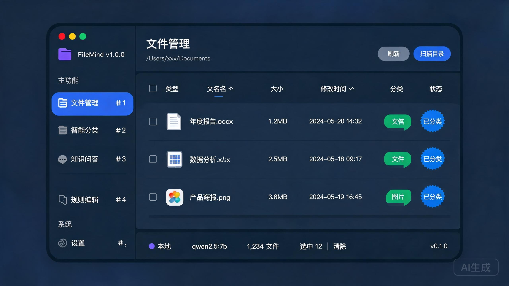
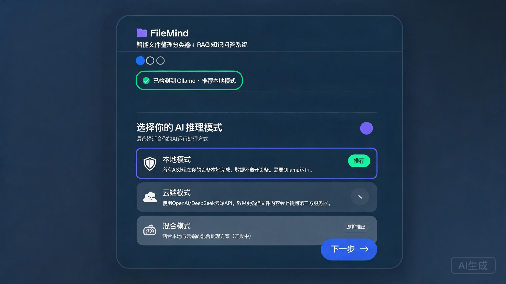
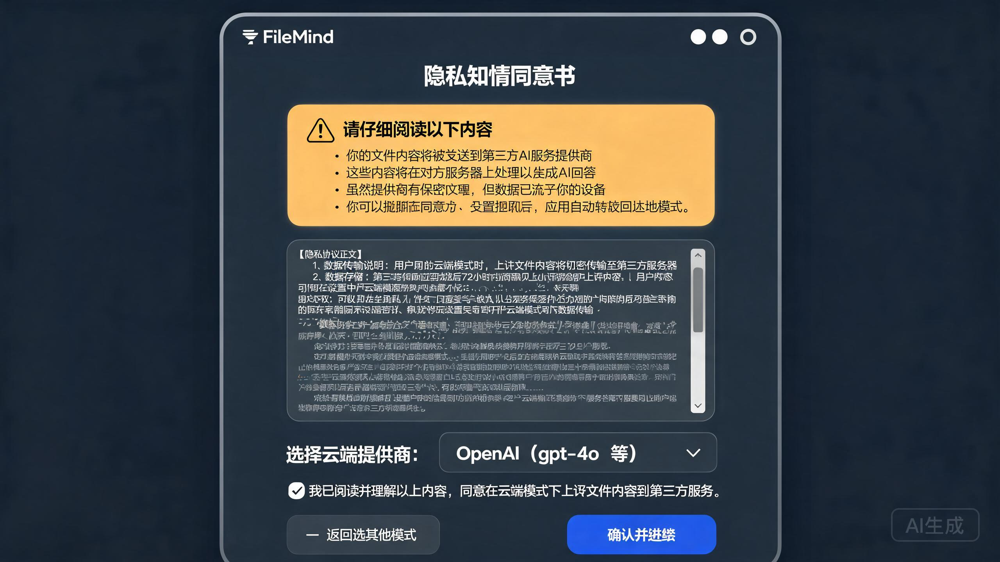
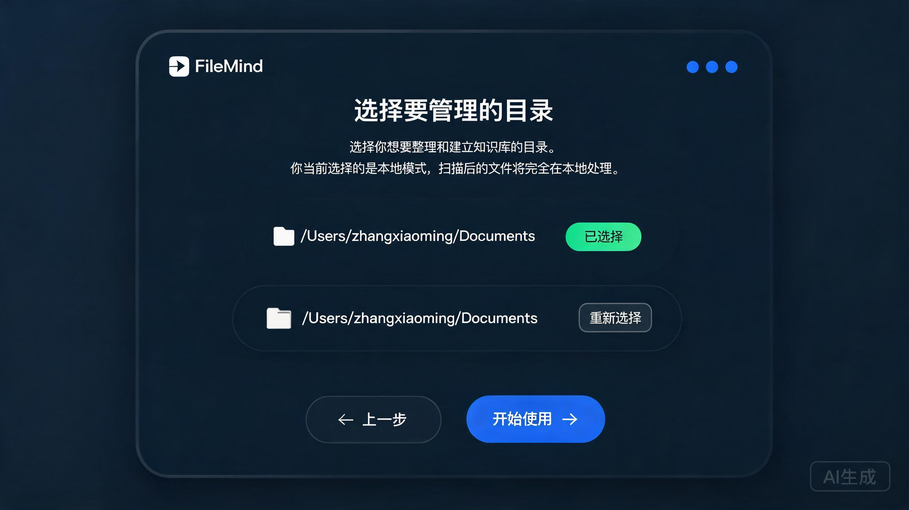
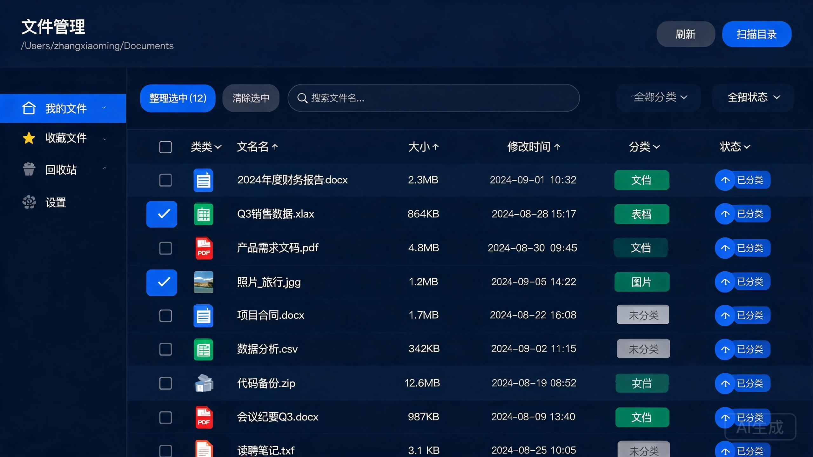
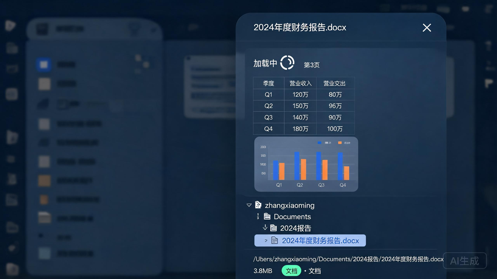
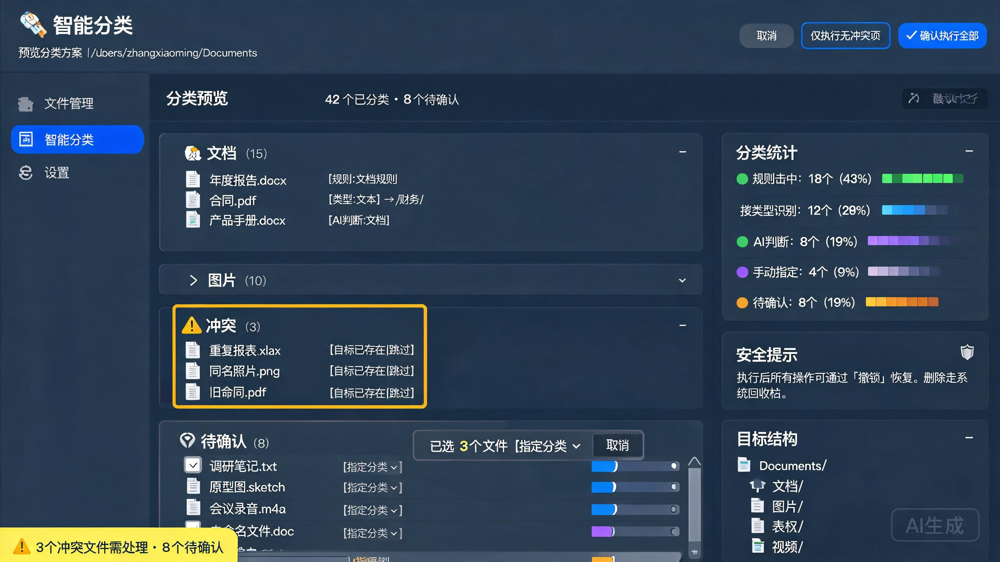
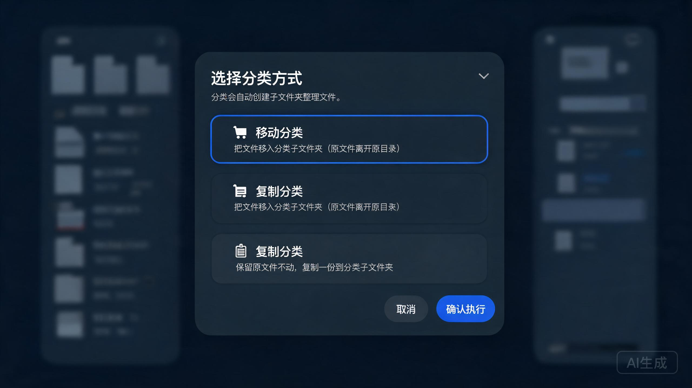
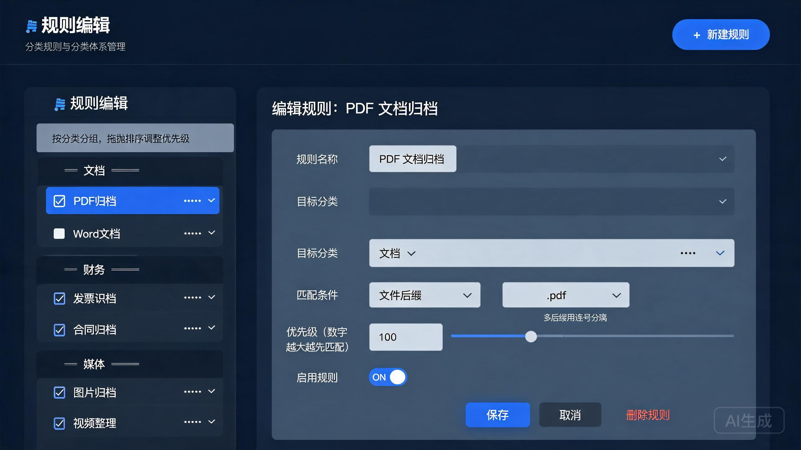
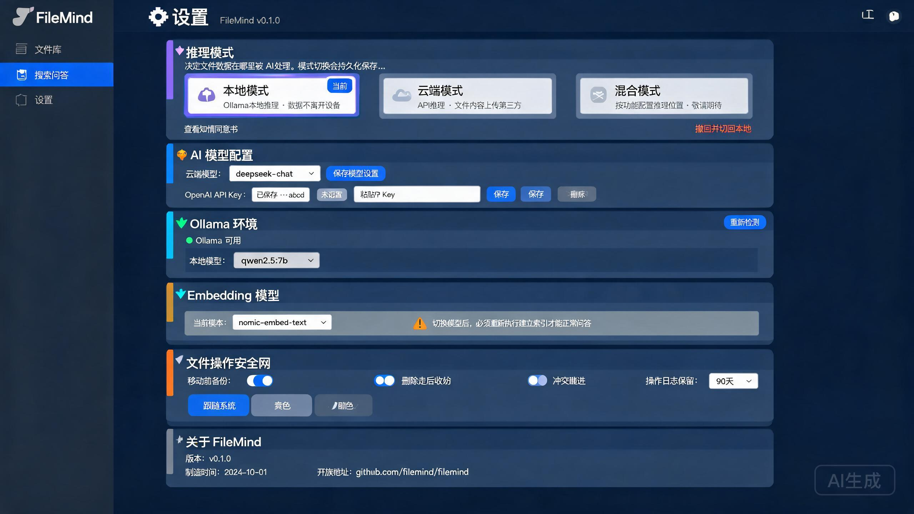

# FileMind 使用教程

> FileMind 是一个 **桌面文件整理分类器 + RAG 知识问答系统**。本文档将带你一步步了解所有功能模块的使用方法，包括首次启动引导、文件管理、智能分类、知识问答、规则编辑和系统设置。

---

## 目录

1. [整体界面布局](#1-整体界面布局)
2. [首次启动引导](#2-首次启动引导)
3. [文件管理](#3-文件管理)
4. [智能分类](#4-智能分类)
5. [知识问答](#5-知识问答)
6. [规则编辑](#6-规则编辑)
7. [设置](#7-设置)
8. [快捷键速查表](#8-快捷键速查表)
9. [常见问题 FAQ](#9-常见问题-faq)

---

## 1. 整体界面布局

打开 FileMind 后，你会看到如下的三栏式布局：



### 各区域说明

| 区域                        | 说明                                                               |
| --------------------------- | ------------------------------------------------------------------ |
| **Sidebar（左侧导航栏）**   | 5 个功能入口 + 品牌标识，支持快捷键快速切换                        |
| **Header（页面头部）**      | 显示当前页面名称、副标题（如当前目录路径）、以及本页可用的操作按钮 |
| **主内容区**                | 各功能页面的主体区域，结构随页面不同而变化                         |
| **StatusBar（底部状态栏）** | 实时显示：推理模式徽章、当前模型名、文件总数、选中数量、版本号     |

---

## 2. 首次启动引导

首次打开 FileMind 时，会进入 **3 步引导流程**（不可跳过）。引导完成后会自动开始首次文件扫描。

### 步骤 1：选择 AI 推理模式

**界面效果图：**



**操作步骤：**

1. 进入引导页后，系统会自动检测本机的 **Ollama 环境**

   - ✅ 如果检测成功，顶部会显示绿色提示「已检测到 Ollama · 推荐本地模式」

   - ⚠️ 如果未检测到，会显示黄色警告，提示你需要先安装并启动 Ollama

2. 选择推理模式：

   - **本地模式（推荐）**：所有 AI 推理（文件分类、知识问答）都在本机 Ollama 上完成，文件数据**完全不离开你的设备**

   - **云端模式**：使用 OpenAI 或 DeepSeek 的云端 API，效果更好但文件内容摘要会上传到第三方服务器

   - **混合模式**：即将推出，暂不可用

3. 点击「下一步 →」继续

---

### 步骤 2：隐私知情同意书（仅云端模式）

**如果你选择了「本地模式」，此步骤会被跳过，直接进入步骤 3。**

**界面效果图：**



**操作步骤：**

1. 阅读顶部的 ⚠️ 风险提示框，了解云端模式的隐私含义

2. **向下滚动**同意书全文，直到滚动条到达底部（这是强制的安全门控——未读完前 checkbox 是灰色禁用的）

3. 从下拉框选择你要使用的云端提供商：

   - `OpenAI（gpt-4o 等）`

   - `DeepSeek`

4. 勾选「我已阅读并理解以上内容…」checkbox（滚到底后变为可用）

5. 点击「确认并继续」

**操作效果：**

- 系统在本地保存你的知情同意记录（含提供商、版本号、签署时间）

- 自动切换到「云端模式」

- 进入步骤 3

---

### 步骤 3：选择要管理的目录

**界面效果图：**



**操作步骤：**

1. 点击中间的虚线框区域，系统会弹出**原生文件夹选择对话框**

   - 也可以直接拖拽文件夹到此区域（后续版本支持）

2. 在对话框中选中你希望管理的目录（如「文档」「下载」或任意文件夹），点击「选择」

3. 确认目录路径显示正确后，点击「开始使用 →」

**操作效果：**

- 引导流程完成，进入主界面

- 系统自动对你选择的目录执行**首次扫描**，扫描结果会出现在「文件管理」页面

- 底部状态栏显示当前目录的文件总数

---

## 3. 文件管理

**入口：** Sidebar 第一项「📁 文件管理」，快捷键 `⌘1`

此页面是你查看、搜索、筛选所有已扫描文件的地方，也是选择文件进行分类的起点。

### 3.1 页面整体结构



### 3.2 扫描目录

**操作步骤：**

1. 点击右上角 **「扫描目录」** 按钮
2. 在弹出的文件夹选择对话框中选择要管理的目录
3. 等待扫描完成（按钮显示「扫描中…」）

**操作效果：**

- 系统递归扫描目录下所有文件（自动跳过隐藏目录和系统目录，如 `.git`、`$recycle.bin` 等）

- 文件信息存入数据库并在列表中显示

- 底部状态栏文件数更新

> **💡 提示：** 可以随时点击「扫描目录」重新选择或追加扫描新目录。点击「刷新」按钮会重新从数据库加载列表而不重新扫描磁盘。

### 3.3 搜索和筛选

| 功能             | 位置                         | 操作方式                                         | 效果                                                                                  |
| ---------------- | ---------------------------- | ------------------------------------------------ | ------------------------------------------------------------------------------------- |
| **按文件名搜索** | 工具栏中间的搜索框           | 逐字输入关键词                                   | 列表实时过滤，只显示文件名包含关键词的条目（使用 `useDeferredValue`，万级文件也不卡） |
| **按分类筛选**   | 工具栏「分类」下拉           | 选择某个分类（如「文档」「图片」）或「全部分类」 | 列表只显示该分类的文件                                                                |
| **按状态筛选**   | 工具栏「状态」下拉           | 选择「已分类」「未分类」或「全部状态」           | 过滤文件处理状态                                                                      |
| **按列排序**     | 表头「文件名/大小/修改时间」 | 点击表头文字，再次点击切换升/降序                | 列表按该列重新排序（箭头 ↕ 指示当前排序方向）                                         |

### 3.4 多选与整理

**操作步骤：**

1. **勾选文件**：点击每行左侧的 checkbox

   - 或点击**表头的 checkbox**一次性选中「当前筛选结果中所有未整理的文件」（半选态 ⚪=部分选中，全选 ☑=全部选中）

2. **查看选中计数**：工具栏第一个按钮实时显示 `整理选中 (N)`，底部状态栏也显示「选中 N 清除」

3. **清除选中**：

   - 点击工具栏的「清除选中」按钮

   - 或点击底部状态栏的「清除」链接

4. **开始整理**：点击「整理选中 (N)」按钮

**操作效果：**

- 点击「整理选中」后，自动跳转到「智能分类」页面，并为选中的文件**自动生成分类预览**

- 如果点击「清除选中」，分类页面的旧预览也会被同步清空（避免残留误解）

### 3.5 文件预览

**触发方式（任选其一）：**

- 🖱️ **点击**任意文件行

- ⌨️ 选中文件后按 **空格键**（Space）

**界面效果图（右侧滑入抽屉）：**



**支持的预览类型：**

| 文件类型                               | 预览方式                                            |
| -------------------------------------- | --------------------------------------------------- |
| **文本** (.txt, .md, .csv, 代码文件等) | 纯文本显示，超长（>512KB）显示截断提示              |
| **HTML** (.html, .htm)                 | 沙箱 iframe 渲染（安全隔离，禁用脚本）              |
| **图片** (.jpg, .png, .gif, .webp 等)  | 内嵌图片显示                                        |
| **PDF** (.pdf)                         | 渲染第一页，底部有「‹ 上一页 1/N 下一页 ›」翻页控制 |
| **其他类型**                           | 显示「暂不支持预览该文件类型」                      |

**关闭方式：**

- 点击右上角 ×

- 点击左侧遮罩空白区域

- 按键盘 `ESC` 键

---

## 4. 智能分类

**入口：** Sidebar 第二项「🏷️ 智能分类」，快捷键 `⌘2`

这是 FileMind 的核心功能——AI 自动识别文件类型并按规则分类到子文件夹。整个流程是 **预览 → 确认 → 执行 → 结果** 的四步安全闭环，所有操作都可撤销。

### 4.1 初始状态（无预览时）

> 智能分类页面在未生成预览时，中央显示「按规则与文件类型自动整理」说明和两个按钮：「对选中的 N 个文件开始分类」（主按钮）和「查看分类历史」（次按钮）。

- **带选中进入**：从文件管理页勾选文件后点「整理选中」，进入此页时**自动生成分类预览**

- **无选中进入**：直接进入此页，点击主按钮「全部分类」=对所有**未整理**的文件执行分类

### 4.2 分类预览（核心界面）

生成预览后，页面分为左右两栏 + 底部警告条：



**左侧预览树详解：**

| 分组              | 说明                                       | 可交互操作                                                          |
| ----------------- | ------------------------------------------ | ------------------------------------------------------------------- |
| **📁 分类名 (N)** | 正常分组：按文件内容/类型识别出的分类      | 点击箭头折叠/展开；**点击文件名**可打开右侧预览抽屉查看该文件内容   |
| **⚠️ 冲突 (N)**   | 目标路径已存在同名文件，执行时默认**跳过** | 显示灰色状态标签「目标已存在（跳过）」                              |
| **❓ 待确认 (N)** | 规则/启发式/AI 都无法判断分类的文件        | **勾选文件 → 顶部出现批量指定分类横幅**；或每行单独从下拉框选择分类 |

**右侧统计面板详解：**

1. **分类统计**：5 行进度条，实时显示各类匹配来源的占比

   - `规则命中`（绿）：匹配了「规则编辑」页面的自定义规则

   - `按类型识别`（蓝）：根据文件后缀名的内置启发式分类

   - `AI 判断`（紫）：LLM 根据文件内容推断的分类

   - `手动指定`（浅紫）：你在预览树中手动指定的分类

   - `待确认`（橙）：仍未分配分类，执行时不处理

2. **安全提示**：提醒你所有操作都可撤销（文件移动走系统回收站，删除也可恢复）

3. **目标结构**：预览这次分类会在你的目录下创建哪些子文件夹，提前了解文件会被整理到哪里

### 4.3 确认执行分类

**操作步骤：**

1. 预览满意后，点击右上角按钮组：

   - **「仅执行无冲突项」**：跳过冲突文件和待确认文件，只处理已分配分类且目标不存在的文件

   - **「✓ 确认执行全部」**：处理所有已分配分类的文件（冲突仍跳过，待确认文件也跳过）

2. 系统弹出「选择分类方式」对话框：

   

3. 选择「移动」或「复制」后，进入执行阶段

**执行阶段与完成结果：**


- 分类按**分块执行**，每完成一批后自动更新进度

- 可随时「暂停」后「恢复」，或「取消」（已执行的文件保留，可撤销）

### 4.4 分类结果面板

执行完成（或取消）后显示汇总（汇总数字卡片效果见上图下半部分，4 个圆形色块：成功绿 42、失败红 3、待确认琥珀 8、未处理灰 7）。

- **成功**：文件顺利移动/复制到目标目录

- **失败**：权限不足、磁盘错误等异常（极少出现）

- **待确认**：预览时未分配分类的文件，跳过未处理

- **未处理**：取消前尚未轮到执行的文件

点击「撤销本批」可以把本次所有文件**恢复到整理前的位置**（移动方式下；复制方式下删除副本）。

### 4.5 分类历史

从初始页点击「查看分类历史」进入。列表展示最近若干批次整理记录，每行显示：执行时间、移动/复制方式、成功/总数、状态（✅完成 / ⏸取消）、末尾「撤销」按钮。

- **点击某条历史**：进入该批次的明细页，查看每个文件的执行日志（成功/失败原因、原路径→目标路径）

- **撤销**：任意历史批次都可以撤销（即使是几天前的），系统会尽量恢复，原路径已被占用时会提示撤销失败

---

## 5. 知识问答

**入口：** Sidebar 第三项「💬 知识问答」，快捷键 `⌘3`

此功能基于 **RAG（检索增强生成）** 技术——先把你的文件建立语义索引，提问时从索引中检索最相关的文档片段，再让 AI 基于这些片段生成答案，答案**附带可跳转的引用来源**。

### 5.1 第一步：建立索引

**在首次提问前，必须先建立索引。** Header 上的「建立索引」按钮和副标题「基于 N 个已索引文件」（参考下方完整界面的顶部区域）。

**操作步骤：**

1. 点击顶部「建立索引」按钮
2. 等待按钮文字变为「索引中…」

**操作效果：**

- 系统对所有支持格式的文件（PDF、Word、TXT、Markdown 等）执行：

  - **文本提取**：读取文件内容

  - **分块**：按语义切分为 1024 token 左右的 chunk

  - **向量化**：用 Embedding 模型计算每个 chunk 的向量

  - **入库**：向量存入 LanceDB，文本和元数据存入 SQLite FTS5

- 完成后页面显示一行绿色提示：

  > 「索引完成：128 个文件，跳过 15 个」（跳过的是不支持格式或空文件）

- Header 副标题更新为「基于 128 个已索引文件」

> **💡 提示：** 新增文件后记得再次点击「建立索引」增量刷新。问答只会基于索引中的内容。

### 5.2 提问对话

**界面效果图：**


**输入操作：**

| 操作                 | 快捷键                                             |
| -------------------- | -------------------------------------------------- |
| 发送消息             | `Enter`                                            |
| 换行                 | `Shift + Enter`                                    |
| 新建对话（清空历史） | `⌘N`                                               |
| 输入中文拼音候选     | 不会误触发发送（已处理输入法组合期 `isComposing`） |

**流式输出体验：**

- AI 回答是**逐字流式**出现的，结尾有闪烁光标「▊」

- 下方的「检索状态栏」会实时显示各个阶段：

  - `正在检索…` → 向量检索 + FTS5 全文检索中

  - `检索到 24 个候选 · 重排后 6 条` → 两阶段检索 + Rerank 结果

  - `改写查询: "2024 公司 财务 营收 年报"` → 查询改写优化

  - `正在生成…` → LLM 生成答案

  - `自我纠正 1 次：答案与引用矛盾` → 检测到幻觉自动重试

  - `低置信度` → 引用不足，建议核对原文

### 5.3 引用跳转（核心功能）

**操作步骤：**

1. 在 AI 回答底部看到「📌 引用来源」区，每个引用是一个可点击的 Chip
2. **点击任意引用 Chip**（如 `[1] 2024年度财务报告.pdf · p.5`）

**操作效果：**

- 右侧弹出**文件预览抽屉**（与文件管理页的预览抽屉完全一致）

- **PDF 文件会自动定位到第 5 页**（引用所在页码）

- 文本/图片文件直接定位到内容

- 快速验证 AI 回答的准确性，实现「答案溯源」

> **💡 技术细节：** 引用定位采用 4 级多策略匹配（精确文件名匹配 → 去后缀匹配 → 双向子串匹配 → 后端 LIKE 兜底），即使文件名有轻微差异也能命中。

### 5.4 多轮对话

AI 会自动携带上一轮对话的上下文。你可以追问：

- 「这些数据的同比增速是多少？」

- 「把上面的回答整理为 3 点摘要」

- 「引用\[2]中的会议是什么时候开的？」

点击顶部「🧹 清空对话」或按 `⌘N` 可以开始全新对话。

---

## 6. 规则编辑

**入口：** Sidebar 第四项「📋 规则编辑」，快捷键 `⌘4`

自定义分类规则是智能分类的第一道防线——规则匹配的优先级 > 类型识别 > AI 判断 > 待确认。**命中规则的文件不会再走 LLM 判断，速度最快、结果最确定。**

### 6.1 页面结构



### 6.2 新建规则

**操作步骤：**

1. 点击右上角 **「+ 新建规则」**
2. 右侧空表单被打开，按以下字段填写：

| 字段                | 说明                                                   | 示例           |
| ------------------- | ------------------------------------------------------ | -------------- |
| **规则名称**        | 方便识别的规则描述（必填）                             | `PDF 文档归档` |
| **目标分类**        | 命中后文件被分到哪个文件夹选「不指定」则只打标签不移动 | `文档`         |
| **匹配条件 - 类型** | 支持 3 种匹配方式                                      | 见下表         |
| **匹配条件 - 模式** | 对应类型的匹配值                                       | 见下表         |
| **优先级**          | 数字越大越先匹配（也可列表拖拽排序）                   | `100`          |
| **启用规则**        | 开关：关闭后规则不参与匹配                             | `开`           |

**匹配条件类型详解：**

| 类型                      | 匹配逻辑                                     | 模式示例                                     |
| ------------------------- | -------------------------------------------- | -------------------------------------------- |
| **文件后缀**              | 文件名结尾匹配（大小写不敏感）               | `.pdf` 或 `pdf,docx,txt`（多后缀用逗号分隔） |
| **路径关键词**            | 文件完整路径中包含关键词（子串匹配）         | `合同`、`invoice`、`2024/财务`               |
| **正则表达式**            | 对文件完整路径执行正则匹配（前端预校验语法） | `^.*财务\d{4}.*\.xlsx$`                      |
| **文件头特征 / 文件大小** | 即将推出，暂不可选                           | -                                            |

1. 点击「保存」

**操作效果：**

- 规则出现在左侧列表中

- 下次执行智能分类时，匹配该规则的文件会优先按此规则分类（在「分类预览树」中该文件会显示 `[规则:PDF归档]` 标签）

### 6.3 编辑和删除

- **编辑**：点击左侧列表中的任意规则，右侧表单填充该规则内容，修改后点击「保存」

- **启用/禁用切换**：直接在列表中点击规则行的 ☑/☐ 开关（立即生效，无需保存）

- **排序**：拖拽左侧列表行上下移动，顺序即为规则匹配的优先级顺序

- **删除**：在右侧表单底部点「删除规则」→ 弹出二次确认框 → 确认删除

### 6.4 规则匹配顺序

智能分类执行时的判断流程（从高到低）：

> 1. **自定义规则**（按优先级排序，高→低） → 命中则按规则分类
> 2. **文件后缀启发式识别**（.pdf→文档，.jpg→图片...） → 命中则按类型分类
> 3. **LLM 根据文件内容语义判断** → 分类名置信度足够则分类
> 4. **无法判断** → 进入「❓ 待确认」组，需用户手动指定

---

## 7. 设置

**入口：** Sidebar 第五项「⚙️ 设置」，快捷键 `⌘,`

管理推理模式、AI 模型配置、Ollama 环境、主题、安全开关等。页面采用 720px 居中的分组卡片布局：



### 7.1 🛡️ 推理模式

> 对应截图最上方的第 1 张分组卡片：「🛡️ 推理模式」（本地/云端/混合三选 + 知情同意书链接）

决定文件数据在哪里被 AI 处理。模式切换会持久化保存，重启后仍然生效。

**操作：**

- 点击「本地模式」卡片 → 立即切回本地（如果当前是云端，会自动撤回云端同意并切换）

- 点击「云端模式」卡片 → 弹出完整的知情同意书弹窗（与首次引导的 Step 2 相同），签署后才切换

- 点击「查看知情同意书」→ 弹出只读的同意书全文弹窗

- 点击「撤回并切回本地」（云端模式下）→ 一键撤回同意并切回本地模式

### 7.2 🤖 AI 模型配置

> 对应截图第 2 张分组卡片：云端模型下拉框 + OpenAI Key「已保存 ····abcd」+ DeepSeek Key「未配置」

配置云端推理模型与 API Key。Key 仅保存在系统钥匙串（Keychain），界面只显示末 4 位。

**操作步骤（配置云端 Key）：**

1. 从对应平台（OpenAI platform 或 DeepSeek 平台）复制你的 API Key
2. 粘贴到对应输入框（密码输入框，不显示明文）
3. 点击「保存」
4. 保存成功后，输入框自动清空，行首显示「已保存 ····abcd」（只显示末 4 位，安全设计——**前端永远拿不到完整 Key**）

**删除 Key：** 点击「删除」→ 二次确认 → 从系统 Keychain 中彻底移除

### 7.3 🔧 Ollama 环境

> 对应截图第 3 张分组卡片：绿色圆点「● Ollama 可用」+ 重新检测按钮 + 本地模型 qwen2.5:7b 下拉框

本地推理引擎状态与模型选择。

- 如果显示「不可用」，请到 [ollama.com](https://ollama.com) 下载安装并启动 Ollama 服务

- 安装完成后点击「重新检测」即可

- 推荐至少使用 `qwen2.5:7b` 及以上模型以保证分类/问答质量

### 7.4 🔍 Embedding 模型

> 对应截图第 4 张分组卡片：当前模型 nomic-embed-text 下拉框 + 琥珀色⚠️「切换模型后，必须重新执行建立索引」提示

知识问答向量化使用的模型，决定检索质量。切换后必须重新执行「建立索引」才能正常问答。

### 7.5 🛡️ 文件操作安全网

> 对应截图第 5 张分组卡片：移动前备份开关、删除走回收站开关、冲突跳过开关、操作日志保留 90 天 下拉框

所有开关都是实时保存生效。建议**保持全部开启**，这是防止误操作的最后一道防线。

### 7.6 🎨 外观

> 对应截图第 6 张分组卡片下方的「跟随系统 / 亮色 / 暗色」三态分段切换按钮组

三态分段按钮，点击即切换。**跟随系统**会根据系统的亮暗模式自动变化。

### 7.7 关于 FileMind

显示版本号、构建时间、开源许可证、官方链接等信息。

---

## 8. 快捷键速查表

| 快捷键            | 功能                        | 生效范围       |
| ----------------- | --------------------------- | -------------- |
| `⌘1`              | 跳转到 **文件管理** 页面    | 全局           |
| `⌘2`              | 跳转到 **智能分类** 页面    | 全局           |
| `⌘3`              | 跳转到 **知识问答** 页面    | 全局           |
| `⌘4`              | 跳转到 **规则编辑** 页面    | 全局           |
| `⌘,`              | 跳转到 **设置** 页面        | 全局           |
| `Space`（空格键） | 预览选中的第一个文件        | 文件管理页     |
| `Enter`           | 发送消息                    | 知识问答输入框 |
| `Shift + Enter`   | 换行                        | 知识问答输入框 |
| `⌘N`              | 新建对话（清空）            | 知识问答页     |
| `ESC`             | 关闭当前弹窗 / 关闭预览抽屉 | 全局           |

---

## 9. 常见问题 FAQ

### Q1: 本地模式 vs 云端模式，我该选哪个？

| 维度         | 本地模式（推荐）                 | 云端模式                                 |
| ------------ | -------------------------------- | ---------------------------------------- |
| **隐私**     | ✅ 数据完全不离开设备，最安全    | ⚠️ 文件内容摘要上传到第三方              |
| **效果**     | ⭐⭐⭐⭐ 取决于本地模型大小      | ⭐⭐⭐⭐⭐ 商业大模型效果更优            |
| **速度**     | 取决于本机 GPU（M 系列芯片很快） | 取决于网络和 API 并发                    |
| **成本**     | 免费（使用自家硬件）             | 按 API 调用量付费                        |
| **推荐场景** | 个人文档、敏感数据、隐私要求高   | 复杂文档理解、深度总结、对准确性要求极高 |

你可以随时在「设置 → 推理模式」中切换。

---

### Q2: 扫描目录后文件列表是空的？

1. 检查当前目录确实有文件（不是空文件夹）
2. 确认不是只包含 **不支持的格式**（如二进制 exe、压缩包等——它们仍会出现在列表中但不会被向量化）
3. 确认目录不是隐藏目录（以 `.` 开头）或系统目录（如 `$Recycle.bin`）
4. 点击「扫描目录」按钮重新选择并扫描

---

### Q3: 智能分类后，有些文件在「待确认」里没处理？

这是正常的安全设计。AI 无法以较高置信度判断分类的文件会进入待确认，**不会被乱动**。处理方式：

1. 在预览树的「❓ 待确认」分组中，勾选文件
2. 从分组顶部的批量下拉框选择分类
3. 或对单个文件，从行尾的下拉框选择分类

处理完后数字会实时更新到底部警告条和右侧统计面板。

---

### Q4: 分类错了怎么办？可以撤销吗？

**完全可以，撤销是一等公民功能：**

- **刚分类完**：在结果面板直接点击「撤销本批」

- **过了一段时间**：进入智能分类页 → 点击「查看分类历史」→ 找到对应批次 → 点击「撤销」

- **个别文件**：手动在 Finder/资源管理器中拖回原位（或重新分类指定）

移动方式下文件会尽量恢复到原来的路径；如果原路径已经被新的同名文件占用，会撤销失败并报错。

---

### Q5: 知识问答回答不准确或"胡说八道"？

1. **先看引用**：点击回答底部的引用 Chip，跳到原文核对。引用不足时 AI 会在气泡下方标注「低置信度：答案可能不够准确」
2. **重建索引**：新增/修改了文件后，再次点击「建立索引」
3. **换更好的模型**：本地模式下升级到 14B 以上模型；云端模式下切换到 GPT-4o / DeepSeek Reasoner
4. **改写提问**：把问题描述得更具体，例如「2024 年度报告第 3 章中提及的营收是多少？」而不是「营收多少？」

---

### Q6: Ollama 显示不可用？

1. 到 [ollama.com](https://ollama.com/) 下载安装对应平台的 Ollama
2. 启动 Ollama 应用（macOS 菜单栏显示 🦙 图标即为运行中）
3. 命令行执行 `ollama pull qwen2.5:7b` 下载推荐模型
4. 回到设置页，点击「Ollama 环境」的「重新检测」按钮

---

### Q7: 可以同时管理多个目录吗？

每次「扫描目录」会覆盖上一次的扫描路径，当前只支持**单目录管理**。建议的做法是：

- 选择最上层的父目录（如 `/Users/xxx/` 下的整个「文档」文件夹）作为扫描根目录

- 子目录内的文件会被递归扫描

多 workspace 支持会在后续版本推出。

---

### Q8: 我的数据存在哪里？可以备份吗？

所有数据存储在以下位置（`FILEMIND_DATA_HOME`）：

- **macOS**：`~/Library/Application Support/filemind/`

- **Windows**：`%APPDATA%\filemind\`

- **Linux**：`~/.config/filemind/`

目录结构：

```
filemind/
├── filemind.db        ← SQLite 数据库（文件元数据、规则、分类历史、同意书）
├── lancedb/           ← LanceDB 向量索引（知识问答的向量库）
├── logs/              ← 操作日志
└── backups/           ← 分类前的自动备份
```

整个目录可以整体复制做备份，迁移到新机器时放回相同位置即可。

---

## 恭喜你掌握了 FileMind 的全部功能！🎉

推荐的使用流程：

1. 扫描你的主要文档目录
2. 去「规则编辑」创建几条常用的自定义规则
3. 去「智能分类」执行一次完整的自动整理
4. 在「知识问答」建立索引，开始向你的文件库提问
